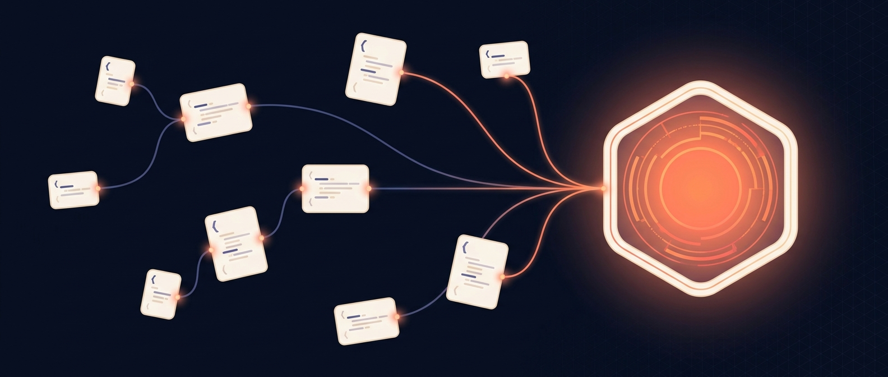
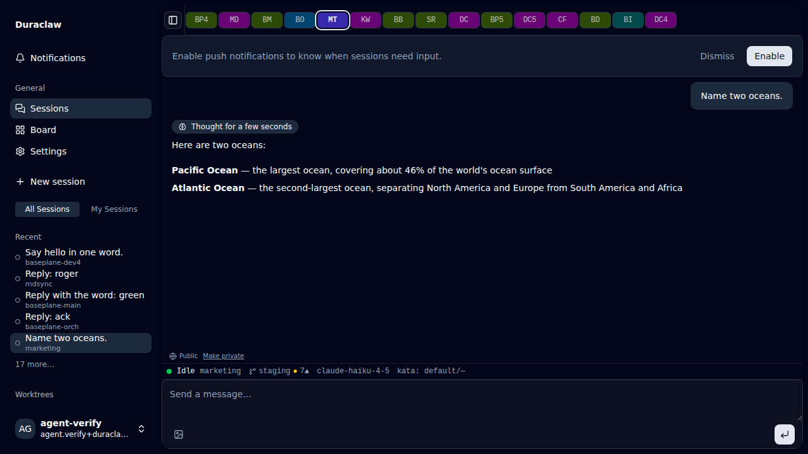

<!--
  README design notes (see planning/research/2026-04-26-readme-overhaul.md):
  - Human-facing. Agent-facing rules live in CLAUDE.md. Do not duplicate.
  - This README is the index of everything — long is fine, the TOC up top
    is what makes it skim-friendly. Defer deep mechanics to per-package
    READMEs and .claude/rules/, but link them from here.
  - Architecture ASCII block is mirrored from CLAUDE.md — keep them in sync.
  - Hero image is generated; see docs/hero/ for variants.
-->

<p align="center">
  
</p>

<h1 align="center">Duraclaw</h1>

<p align="center">
  <strong>An AI-native code-orchestration platform — the harness for building with AI at scale.</strong><br>
  Centralized, auditable scaffolding for enterprise agent workflows: many concurrent sessions across worktrees,<br>
  on the web and on Android, with automated agent progression, customized inference,<br>
  and multi-tiered deployment so security and vendor-lock-in stop blocking AI adoption.
</p>

<p align="center">
  <a href="#architecture"></a>
  <a href="#architecture"></a>
  <a href="apps/orchestrator"></a>
  <a href="apps/mobile"></a>
  <a href="LICENSE"></a>
</p>

> **Positioning.** Duraclaw is a foundational **harness** for AI
> coding at scale, not a vertical SaaS. It targets enterprise
> technology orgs that need centralized, auditable scaffolding around
> their agent workflows — every session, every tool call, every gate
> approval, and every model choice is logged, replayable, and bound to
> a worktree + identity. The architecture is deliberately flexible
> along the three axes that drive corporate AI anxiety:
> **automated agent progression** (kata phase contracts + chains
> auto-advance run sessions through research → planning →
> implementation → verify gates without a human in the loop on every
> hop), **customized inference** (per-session driver + model + identity
> selection: Claude / Codex / Gemini today, isolated `HOME` per
> identity, per-tenant model registries), and **multi-tiered
> deployment** (self-host on your own Workers + VPS today; managed and
> air-gapped tiers on the roadmap). The goal is to mitigate the
> security and vendor-lock-in concerns that block AI adoption inside
> larger orgs — your code, your runner, your audit log, your choice of
> upstream model.

> **Status — active development.** Built and used in-house at
> [@baseplane-ai](https://github.com/baseplane-ai), but the repo is
> public and self-hostable via two install scripts:
> `scripts/install-orchestrator.sh` (Cloudflare side — D1, R2,
> secrets, deploy) and `packages/agent-gateway/systemd/install.sh`
> (VPS side — Bun + systemd). Bring your own Workers Paid account
> and a Linux box with sudo. The Capacitor Android shell ships in
> this repo too — same source tree, same Worker — but its OTA
> channel needs an extra upload step that lives in a separate deploy
> pipeline (see [Deployment → Android shell + OTA
> channel](#optional-android-shell--ota-channel)).

> **Multi-driver runner.** The `session-runner` selects an executor at
> spawn time via a `RunnerAdapter` interface — three adapters ship
> today: **Claude** (via
> [`@anthropic-ai/claude-agent-sdk`](https://www.npmjs.com/package/@anthropic-ai/claude-agent-sdk)),
> **OpenAI Codex** (via the [Codex CLI](https://github.com/openai/codex)),
> and **Google Gemini** (via the [Gemini CLI](https://github.com/google-gemini/gemini-cli)).
> Each driver has its own admin-managed model registry in D1
> (`codex_models`, `gemini_models`) and a per-driver settings tab; the
> spawn / draft-tab form lets you pick agent + model per session.
> Adding a fourth adapter is mechanical — implement `RunnerAdapter`
> and register it. See [Roadmap](#roadmap) (Phase 10.3 — landed).

---

## Table of Contents

1. [What it is](#what-it-is)
2. [Features](#features)
3. [Chat UI vs. the Claude Code CLI](#chat-ui-vs-the-claude-code-cli)
4. [What it is not](#what-it-is-not)
5. [Architecture](#architecture)
6. [Repository map](#repository-map)
7. [Tech stack](#tech-stack)
8. [Quickstart](#quickstart)
9. [Common commands](#common-commands)
10. [Deployment](#deployment)
11. [Contributing](#contributing)
12. [Roadmap](#roadmap)
13. [Acknowledgments](#acknowledgments)

---

## What it is

Duraclaw is **the harness layer** between an enterprise codebase and
the agent SDKs / CLIs that work it. It's the scaffolding most orgs
discover they need around month two of taking AI coding seriously: a
centralized, auditable place where many agent sessions run in
parallel, every tool call lands in a queryable event log, every
worktree is reservation-tracked, and every model / driver / identity
choice is policy-controlled instead of per-developer-laptop. The
shape is deliberate — three flexibility axes (driver, identity,
deployment tier) so the same platform serves a 10-engineer startup
running everything on managed CF Workers and a regulated enterprise
running an air-gapped fork on their own infra with their own model
gateway.

The narrower / day-one pain it also solves: running a fleet of
Claude Code (or Codex, or Gemini) sessions across worktrees is
painful with the stock CLIs. Context lives in tmux panes, there's no
shared inbox, no mobile, no resume across SSH disconnects, and no
way to triage *"which session is asking me a question right now?"*
across a dozen of them. Duraclaw is the orchestration fabric that
fixes that — and the harness underneath happens to be the same thing
enterprises need for governance.

A Cloudflare Workers frontend — a plain Vite 8 SPA built with React 19 and [TanStack Router](https://tanstack.com/router) for client routing, [Hono](https://hono.dev/) on the Worker side for API routes, deployed via the [`@cloudflare/vite-plugin`](https://developers.cloudflare.com/workers/vite-plugin/) — owns session
lifecycle through four [Durable
Objects](https://developers.cloudflare.com/durable-objects/) — `SessionDO`
(per-session state + SQLite message history + event log), `UserSettingsDO`
(per-user prefs and push-subscription registry), `SessionCollabDO`
(realtime collab via Y.js for multi-tab session views), and
`RepoDocumentDO` (Yjs-backed real-time markdown collab on repo files,
fed by a per-repo `docs-runner`). Better Auth on D1 handles sign-in;
R2 stores the mobile OTA bundle.

A VPS-side `agent-gateway` spawns detached runner processes — one
`session-runner` per chat session and one `docs-runner` per repo —
and each runner dials its Durable Object directly over a buffered
WebSocket. The session-runner picks an adapter at spawn time
(`RunnerAdapter` interface) — Claude via `@anthropic-ai/claude-agent-sdk`,
Codex via the Codex CLI, or Gemini via the Gemini CLI — so a single
runner process can host any of the three drivers. The docs-runner
owns the chokidar watch + Yjs sync. Gateway and runners ship as
**self-contained Bun bundles** (atomic `mv` in place via
`scripts/bundle-bin.sh`), so a `git pull` + rebuild on the VPS never
race-corrupts a running runner. Gateway restarts and Worker redeploys
are non-events: the `BufferedChannel` (10K events / 50 MB ring)
replays on reconnect, and SDK / CLI transcripts persist on disk for
resume.

Layered on top:

- a **Capacitor 8 Android shell** that ships the same React UI as a
  thin native client, with **Capgo web-bundle OTA** for JS-only
  releases and a native-APK fallback poll for Capacitor / plugin
  bumps;
- a **dual-channel push system** — Web Push (VAPID) for browsers, FCM
  HTTP v1 for Android — fanning out from the same `UserSettingsDO`
  subscription registry;
- [**`kata`**](packages/kata/) — a structured-workflow CLI that adds
  phase tasks, context injection, and **exit-gate enforcement** to
  Claude Code sessions. Sessions can't quietly close mid-feature: the
  stop-hook blocks until the phase contract is satisfied or
  explicitly waived.

<p align="center">
  
  <br>
  <sub><em>Fifteen concurrent Claude sessions, one per worktree, fanned out as draggable tabs above a live chat. Sidebar = recents + worktree groups; status bar = per-session model, mode, and connection state.</em></sub>
</p>

## Features

A non-exhaustive map of what's actually shipped. See
[`planning/progress.md`](planning/progress.md) for live phase / subphase
status.

**Multi-driver / multi-provider**

- **Three runner adapters today**: Claude
  (`@anthropic-ai/claude-agent-sdk`), OpenAI Codex (Codex CLI),
  Google Gemini (Gemini CLI), all behind a single `RunnerAdapter`
  interface in `packages/session-runner/src/adapters/`
- D1-backed admin model registries (`codex_models`, `gemini_models`)
  with full CRUD pages at `/admin/codex-models` and
  `/admin/gemini-models`; the spawn payload reads the catalog at
  dispatch time
- Per-driver Settings → Defaults tabs (Claude / Codex) for model,
  permission mode, thinking effort, max budget
- Agent + model selector on the new-session draft tab; chains
  workflow auto-routes by configured driver
- `kata` workflow CLI runs against either Claude Code or Codex CLI as
  the host driver — same modes, same exit-gate enforcement, dual hook
  installation (GH#109)

**Sessions**

- Many concurrent agent sessions, each with its own runner process and
  Durable Object — Claude / Codex / Gemini sessions coexist on the
  same gateway and dashboard
- Session lifecycle: create, list, search, history, fork, rename,
  abort, force-stop, delete, export
- **Create-then-spawn**: a new session can be created (and given a
  first prompt) before the runner is dispatched, so the chat surface
  is interactive immediately and runner spawn is deferred until send
- **Haiku auto-titler**: sessions are auto-named once the transcript
  crosses a token threshold, with a confidence score and never
  clobbering a user-set title; admin-toggled via the
  `haiku_titler` feature flag
- Per-session SQLite message history (live in the DO) mirrored to D1
  for cross-device list views
- Session resume across runner reaper / SSH disconnect / Worker
  redeploy — `sdk_session_id` persists, transcripts replay from disk
- Orphan-runner self-healing — `forkWithHistory` re-spawns a fresh SDK
  session prefixed with the prior transcript when the runner is
  unreachable
- Rewind / branch navigation (DO-authored snapshots, no client-side
  history mutation)
- Tool-call approval gates (`AskUserQuestion`, `permission_request`)
  with a per-session attention queue
- Live `contextUsage` / cost / token / duration accounting
- Per-session `event_log` (durable, 7-day retention) for replay /
  diagnostics

**Multi-session UI**

- Multi-session tab bar with live status indicators
- Status bar with connection / runner / WS state, attention badges,
  cost / token meters
- Cmd-K command menu for cross-session navigation
- Quick-prompt input — fire a message into any session from the global
  shell
- Workspace / project switcher
- Realtime collab cursors and presence (Y.js via `SessionCollabDO`)
- Notification bell + drawer driven by per-event preferences
- TanStack DB synced collections (`user_tabs`, `user_preferences`,
  `projects`, `chains`) with optimistic mutations + WS-driven sync

**Mobile (Android)**

- Capacitor 8 native shell wrapping the same React UI
- Capgo web-bundle OTA — JS-only releases ship via R2 with no APK reinstall
- Native-APK fallback updater for Capacitor / plugin bumps
- Native swaps: `@capacitor-community/sqlite` for OPFS, bearer auth
  via `better-auth-capacitor`, FCM HTTP v1 for push, `useAgent` host
  override for the Worker WSS endpoint
- Wireless ADB sideload workflow for dev iteration

**Push notifications (dual-channel)**

- Web Push (VAPID) for browsers, FCM HTTP v1 for Android
- Same `UserSettingsDO` subscription registry fans out both channels
- Per-event preferences (`gate-required`, `runner-error`, `done`, ...)
- Opt-in banner with permission-state persistence

**Workflow CLI ([`kata`](packages/kata/))**

- 7 modes: `research`, `planning`, `implementation`, `debug`, `task`,
  `verify`, `freeform`
- Phase tasks injected at session start (Setup → Work → Close)
- **Exit-gate enforcement** — stop-hook blocks until the phase
  contract is satisfied or explicitly waived
- Mode-specific skill scripts (kata-setup, kata-research, kata-close,
  kata-debug-methodology, kata-spec-review, ...)
- Context auto-injection: `CLAUDE.md`, `AGENTS.md`,
  `.claude/rules/<scope>.md`
- Session evidence captured under `.kata/verification-evidence/`
- Verification-policy CLI: per-subphase `verify:*` commands run real
  curl + browser checks

**Auth & access**

- Better Auth on D1 with Drizzle adapter (email + OTP)
- Per-session visibility: private / public / shared
- Admin user management page
- Feature-flag system with admin patch endpoints
- Bootstrap-token + gateway-secret rotation paths
- **Identity catalog + account failover** — multiple isolated `HOME`
  directories (each with its own `~/.claude/.credentials.json`) registered
  as named identities; the DO LRU-selects an identity at spawn, marks
  rate-limited identities `cooldown`, and resumes the session under the
  next available one via the SDK's `SessionStore` (no message loss)

**Auditability & governance**

- Per-session **`event_log`** in DO SQLite (durable, 7-day retention,
  GC'd on `onStart`) — every gate, connection event, callable RPC,
  reaper decision, and rate-limit / identity-rotation event recorded
  via `logEvent()`; queryable via the `getEventLog()` RPC by tag and
  time range
- **Identity catalog** in D1 (`runner_identities`) records which
  Anthropic OAuth subscription owned each session and when it was
  rotated to cooldown — pair with `agent_sessions.identity_name` for a
  full provenance chain from prompt to billed account
- **Worktree reservations** in D1 (`worktrees` table) with explicit
  `reservedBy = {kind, id}` shapes, idempotent re-acquire, and
  release timestamps — every code-touching session is bound to a
  named clone with a known reserver
- **Kata phase evidence** (`.kata/verification-evidence/`) — verify
  mode lands real curl + browser proofs alongside the code, so a
  session that claims "done" has artifacts a reviewer can replay
- Tool-call approval gates (`AskUserQuestion`, `permission_request`)
  surface in a per-session attention queue — humans-in-the-loop are
  rate-limited, not bypassed, and every approval / denial is logged

**Backend hardening**

- BufferedChannel ring (10K events / 50 MB) absorbs gateway / Worker
  redeploys with at-most-one gap sentinel
- Dial-back WSS with timing-safe token validation, 1/3/9/27/30s
  reconnect ladder
- Cron-scheduled cleanup of stale sessions / orphan runners
- D1-mirrored session rows for fast list views, DO as live truth

**Integrations**

- GitHub webhooks (chains feature — issue → impl → verification flow)
- **Worktrees as first-class reservable resources** — pool-backed
  `/api/worktrees` (reserve / list / release / delete), gateway-side
  60s sweep that classifies each clone under `/data/projects/<name>`
  via branch + `.duraclaw/reservation.json`, idempotent re-acquire by
  reservedBy, and `agent_sessions.worktreeId` FK so each session is
  bound to a concrete clone
- "Chains" workflow: claim issue → checkout worktree → run
  implementation session → release

**Developer ergonomics**

- Per-worktree port derivation (`cksum % 800`) — clones don't collide
- One-shot setup script (`scripts/setup-clone.sh`)
- Real-curl + browser verification harnesses with no mocks
- PWA install with offline shell + service-worker update banner

## Chat UI vs. the Claude Code CLI

The Claude Code CLI is a single-pane terminal experience: streaming text,
ANSI-rendered Markdown, ANSI-highlighted code blocks, inline tool-call
log lines, and inline yes/no permission prompts — all stacked in one
scrollback. It's fast, focused, and the source of truth for the agent
loop.

Duraclaw runs the same agent loop, but renders it through
[`@duraclaw/ai-elements`](packages/ai-elements/) — a vendored fork of
[Vercel AI Elements](https://ai-sdk.dev/elements) — so each event class
gets its own purpose-built React surface instead of more scrollback.

| Capability | Claude Code CLI | Duraclaw chat UI |
|---|---|---|
| Streaming assistant text | Token stream into terminal | `<Conversation>` + `<Message>` with progressive render |
| Markdown | ANSI-rendered Markdown | [Streamdown](https://github.com/vercel/streamdown) with full GFM, tables, math, mermaid, CJK packs — **rendered while streaming** |
| Code blocks | ANSI syntax highlight | `<CodeBlock>` powered by [Shiki](https://shiki.style/) with a copy button, language label, and theme-aware tokens |
| Diffs | Plain text diff | Dedicated diff renderer with hunk grouping and side-by-side inline view |
| Reasoning / thinking | Inline italic block | `<Reasoning>` — collapsible dedicated surface, separated from final answer |
| Tool calls | Inline log lines | `<ToolCallList>` with collapsed summary + expandable args / output drill-down |
| `Bash` tool output | Raw stdout | `<Terminal>` with `ansi-to-react` color rendering and exit-code chrome |
| `Read` / `Glob` results | Path lists | `<FileTree>` rendered as an actual tree with expand / collapse |
| `Edit` / `Write` results | Diff text | Diff component with file-path header and add/remove gutters |
| `Grep` / search results | Line list | Grouped by file with line-number anchors and language-aware highlighting |
| Test runner output | Raw text | `<TestResults>` + `<StackTrace>` cards with pass / fail summary and frame navigation |
| Build / package output | Raw text | `<PackageInfo>`, `<EnvironmentVariables>`, `<SchemaDisplay>` typed renderers |
| Git operations | Text log | `<Commit>` cards with hash, author, message, file list |
| `WebFetch` / `WebSearch` | Title + snippet | `<WebPreview>` sandboxed iframe + `<InlineCitation>` with sources panel |
| Plans | Markdown checklist | `<Plan>` with `<Checkpoint>` markers and live status per step |
| Tasks / todo lists | Text list | `<Task>` cards driven by a stateful `<WorkflowProgress>` track |
| Images | Path / link only | Inline image rendering + zoomable `<Image>` viewer |
| Audio / video | Not supported | `<AudioPlayer>` + `media-chrome` wrappers |
| Permission prompts | Inline `[y/n]` | `<Confirmation>` cards with action history and per-tool policy memory |
| `AskUserQuestion` | Inline prompt | Rich gate UI with options, free-form fallback, and global attention queue |
| Slash commands | Full local set (`/clear`, `/compact`, `/model`, `/mcp`, ...) | Cmd-K command palette + a subset of slash commands; full parity is **not** there yet |
| Multi-session | One session per terminal | Multi-session tab bar with live status, attention badges, presence cursors |
| Persistence | Local transcript on disk | Live in `SessionDO` SQLite + mirrored to D1 for cross-device list views + R2 for OTA |
| Resume | `claude --continue` | Auto-resume across runner reaper / SSH / Worker redeploy via `sdk_session_id` |
| Mobile | None | Capacitor 8 Android shell with the same chat surface |

**Where the CLI still wins.** Full slash-command surface, MCP-server
flag wiring, plugin / extension hooks, full local-only operation, and
zero infra. If you want one local session with the entire CLI feature
set, use the CLI. If you want a fleet of remote, persistent, observable
sessions with rich per-event renderers and a phone in your pocket, use
duraclaw.

## What it is not

- **Not full feature-parity with the Claude Code CLI.** Claude
  sessions run through `@anthropic-ai/claude-agent-sdk`, which exposes
  most of what the CLI does — but a handful of CLI features (full
  local-only operation, MCP-server flag wiring, `/`-command parity,
  some plugin / extension surfaces) aren't reproduced here. Use the
  CLI when you want a single local session with the full CLI surface;
  use duraclaw when you want a fleet of remote, persistent, observable
  sessions.
- **Not a Claude / Codex / Gemini wrapper or standalone chatbot.**
  Sessions delegate to the upstream agent SDK or CLI behind a
  `RunnerAdapter` — duraclaw orchestrates them, it doesn't reimplement
  them.
- **Not unlimited-provider yet.** Three adapters ship: Claude, Codex,
  Gemini. Custom adapters are tractable (implement `RunnerAdapter`,
  register in the per-runner registry, add a model table + admin CRUD
  if you want per-driver model selection) but no fourth provider is
  wired in today.
- **Not a one-click self-hosted app yet.** It assumes a Cloudflare
  Workers account, D1, R2, and a Linux VPS you control. The deploy
  pipeline is internal infra (see [Deployment](#deployment)).
- **Not iOS yet.** The Capacitor shell is Android-only today; iOS is on
  the roadmap but not shipped.
- **Not a managed or air-gapped tier yet.** The
  multi-tier deployment story is positional; **today only the
  self-hosted tier ships**. Managed (we run it for you, you bring
  your own model accounts) and air-gapped (everything inside your
  network, your own model gateway) are the eventual offerings, but
  neither is wired up. If you need either of those today, you're
  forking the self-hosted path and wiring it yourself.
- **Not a hosted SaaS.** There's no `duraclaw.app` you can sign up
  for. Read the code, lift ideas, run your own.

## Architecture

```
Browser
  |
  v
CF Worker (Vite SPA + Hono) --- React UI + API routes
  |                            + SessionDO / UserSettingsDO / SessionCollabDO
  v
SessionDO (1 per session) --- state + SQLite message history + event_log
  ^          |
  |          | HTTPS POST /sessions/start
  |          v
  |      +- agent-gateway (VPS, systemd) - spawn/list/status/reap
  |      |            |
  |      |            | spawn detached, passes callback_url + token
  |      |            v
  |      +-- session-runner (per session) -- owns Claude SDK query()
  |                   |                      uses BufferedChannel ring (10K/50MB)
  +-------------------+
         dial-back WSS -- direct to DO, reconnects with 1/3/9/27/30s backoff
```

Three invariants hold the design together:

> **1. The gateway never runs the SDK.**
> It's a spawn / list / status / reap control plane, nothing more.
>
> **2. The runner never embeds the Durable Object.**
> It dials the DO over WebSocket and validates against a per-spawn token.
>
> **3. Gateway restart and Worker redeploy are non-events.**
> The `BufferedChannel` (10K events / 50 MB ring) buffers while the WS
> is down and replays on reconnect, emitting one gap sentinel only on
> overflow.

For deeper details, see [`CLAUDE.md`](CLAUDE.md) and the per-subsystem
rules under [`.claude/rules/`](.claude/rules/).

## Repository map

| Path | What it does | Read more |
|---|---|---|
| [`apps/orchestrator`](apps/orchestrator) | Cloudflare Worker + Vite SPA: React UI (TanStack Router + Tamagui), Hono API routes, four Durable Objects (`SessionDO`, `UserSettingsDO`, `SessionCollabDO`, `RepoDocumentDO`), Better Auth on D1, dual-channel push fan-out | [`.claude/rules/orchestrator.md`](.claude/rules/orchestrator.md) |
| [`apps/mobile`](apps/mobile) | Capacitor 8 Android shell + Capgo web-bundle OTA + native-APK fallback updater | [`apps/mobile/README.md`](apps/mobile/README.md) |
| [`packages/agent-gateway`](packages/agent-gateway) | VPS spawn / list / reap control plane (Bun HTTP + systemd); ships as a self-contained Bun bundle | [`packages/agent-gateway/README.md`](packages/agent-gateway/README.md) |
| [`packages/session-runner`](packages/session-runner) | Per-session executor host with a `RunnerAdapter` interface — Claude (Agent SDK), Codex (Codex CLI), and Gemini (Gemini CLI) adapters all live here under `src/adapters/`; one process owns one driver per session; self-contained Bun bundle | [`packages/session-runner/README.md`](packages/session-runner/README.md) |
| [`packages/docs-runner`](packages/docs-runner) | Per-repo markdown / Yjs sync runner — chokidar watches the worktree, dials `RepoDocumentDO`, round-trips edits between disk and the in-browser BlockNote editor; self-contained Bun bundle | — |
| [`packages/shared-transport`](packages/shared-transport) | `BufferedChannel` ring + `DialBackClient` (runner → DO WS, 1/3/9/27/30s backoff) | [`packages/shared-transport/README.md`](packages/shared-transport/README.md) |
| [`packages/shared-types`](packages/shared-types) | `GatewayCommand` / `GatewayEvent` shapes shared across the wire | — |
| [`packages/ai-elements`](packages/ai-elements) | Vendored + customized fork of [Vercel AI Elements](https://ai-sdk.dev/elements) — 50+ chat / code / tool React components (`Conversation`, `Reasoning`, `ToolCallList`, `CodeBlock`, `Terminal`, `FileTree`, ...) over a 25-component Radix UI primitive layer, with [Streamdown](https://github.com/vercel/streamdown) for streaming markdown and [Shiki](https://shiki.style/) for syntax highlighting | — |
| [`packages/kata`](packages/kata) | Structured-workflow CLI for Claude Code: modes (research, planning, implementation, debug, task, verify, freeform), phase tasks, exit-gate enforcement | [`packages/kata/README.md`](packages/kata/README.md) |
| [`planning/`](planning) | Specs, progress tracker, research docs | [`planning/progress.md`](planning/progress.md) |
| [`scripts/verify/`](scripts/verify) | Real-curl + browser verification harnesses (no mocks) | [`AGENTS.md`](AGENTS.md) |

## Tech stack

Every major library duraclaw is built on, grouped by concern. Versions float on the latest minor unless otherwise pinned — see the per-package `package.json` for exact ranges.

**Frontend (`apps/orchestrator`)**

- [React 19](https://react.dev/) + [React DOM](https://react.dev/) — UI runtime
- [TanStack Router](https://tanstack.com/router) — file-based client-side routing (plain SPA, **not** TanStack Start — server APIs are served by Hono on the Worker side)
- [TanStack DB](https://tanstack.com/db) + [TanStack Query](https://tanstack.com/query) + [TanStack Virtual](https://tanstack.com/virtual) — local-first reactive collections, query cache, list virtualization
- [Vite 8](https://vite.dev/) + [`@cloudflare/vite-plugin`](https://www.npmjs.com/package/@cloudflare/vite-plugin) + [`@vitejs/plugin-react`](https://www.npmjs.com/package/@vitejs/plugin-react) — dev server + production build
- [Tailwind CSS 4](https://tailwindcss.com/) + [`@tailwindcss/vite`](https://tailwindcss.com/) + [`tw-animate-css`](https://www.npmjs.com/package/tw-animate-css) — styling
- [Zustand](https://zustand.docs.pmnd.rs/) — client state, [Zod 4](https://zod.dev/) — schema validation
- [`@dnd-kit/*`](https://dndkit.com/) — drag and drop, [`@use-gesture/react`](https://use-gesture.netlify.app/) + [`@react-spring/web`](https://www.react-spring.dev/) — gesture / animation
- [Sonner](https://sonner.emilkowal.ski/) — toasts, [`react-top-loading-bar`](https://www.npmjs.com/package/react-top-loading-bar) — route progress
- [`react-markdown`](https://github.com/remarkjs/react-markdown) + [`remark-gfm`](https://github.com/remarkjs/remark-gfm) + [`rehype-sanitize`](https://github.com/rehypejs/rehype-sanitize) — markdown rendering
- [`input-otp`](https://input-otp.rdsx.dev/), [`cmdk`](https://cmdk.paco.me/) — input primitives

**Realtime / collab**

- [Yjs](https://yjs.dev/) + [`y-partyserver`](https://www.npmjs.com/package/y-partyserver) + [`y-protocols`](https://www.npmjs.com/package/y-protocols) + [`y-indexeddb`](https://www.npmjs.com/package/y-indexeddb) — CRDT collab inside `SessionCollabDO`
- [PartyServer](https://github.com/threepointone/partyserver) + [PartySocket](https://github.com/threepointone/partysocket) — Durable-Object-friendly WebSocket framework
- [`agents`](https://www.npmjs.com/package/agents) — Cloudflare Agents SDK (Durable-Object-backed agent runtime)

**AI / chat UI**

- [Vercel AI SDK (`ai`)](https://sdk.vercel.ai/) + [`@ai-sdk/react`](https://sdk.vercel.ai/) — streaming chat primitives
- **[Vercel AI Elements](https://ai-sdk.dev/elements)** — vendored as `@duraclaw/ai-elements` and customized
- [Streamdown](https://github.com/vercel/streamdown) (`streamdown` + `@streamdown/cjk` / `code` / `math` / `mermaid`) — Vercel's streaming markdown
- [Shiki](https://shiki.style/) — syntax highlighting, [`ansi-to-react`](https://www.npmjs.com/package/ansi-to-react) — terminal color rendering
- [`tokenlens`](https://www.npmjs.com/package/tokenlens) — token accounting, [`@xyflow/react`](https://reactflow.dev/) — graph diagrams
- [`react-jsx-parser`](https://www.npmjs.com/package/react-jsx-parser) — runtime JSX previews, [`media-chrome`](https://www.media-chrome.org/) — media controls, [`@rive-app/react-webgl2`](https://rive.app/) — Rive animations
- [Motion](https://motion.dev/), [`embla-carousel-react`](https://www.embla-carousel.com/), [`use-stick-to-bottom`](https://www.npmjs.com/package/use-stick-to-bottom)

**UI primitives**

- **[Tamagui](https://tamagui.dev/) (`@tamagui/core` + `@tamagui/vite-plugin`)** — owns the orchestrator's theme tokens, dark-mode handling, sidebar, and the migrated primitive layer (`button`, `card`, `input`, `label`, `badge`, `separator`, `avatar`, `tabs`, `textarea`, `table`, `alert`, `skeleton`, `collapsible`); compiler-extracted atomic CSS in the client bundle, **zero `@tamagui/*` bytes in the Worker bundle** (CI guard enforces it)
- [Radix UI](https://www.radix-ui.com/) — retained for the unmigrated complex primitives (alert-dialog, checkbox, dialog, dropdown-menu, hover-card, popover, radio-group, scroll-area, select, slot, switch, tooltip, ...) that Tamagui's primitive layer doesn't yet cover
- [Lucide React](https://lucide.dev/) — icon set
- [`class-variance-authority`](https://cva.style/) + [`clsx`](https://github.com/lukeed/clsx) + [`tailwind-merge`](https://github.com/dcastil/tailwind-merge) — variant authoring + class merging (Tailwind retained mainly to process `@duraclaw/ai-elements` styles)

**Backend (Cloudflare Workers)**

- [Cloudflare Workers](https://workers.cloudflare.com/) + [Durable Objects](https://developers.cloudflare.com/durable-objects/) — runtime + per-session state
- [D1](https://developers.cloudflare.com/d1/) — SQL store for auth (via [Drizzle ORM](https://orm.drizzle.team/) + [`drizzle-kit`](https://orm.drizzle.team/kit-docs/overview))
- [R2](https://developers.cloudflare.com/r2/) — mobile OTA bundle storage
- [Hono](https://hono.dev/) — edge HTTP router, [Wrangler](https://developers.cloudflare.com/workers/wrangler/) — Workers tooling

**Auth**

- [Better Auth](https://www.better-auth.com/) + [`better-auth-capacitor`](https://www.npmjs.com/package/better-auth-capacitor) — sessions on web, bearer tokens on native
- [`jose`](https://github.com/panva/jose) — JWT signing for FCM HTTP v1

**Push notifications**

- [`@pushforge/builder`](https://www.npmjs.com/package/@pushforge/builder) — Web Push (VAPID) payload builder
- [`@capacitor/push-notifications`](https://capacitorjs.com/docs/apis/push-notifications) — FCM bridge on Android

**Mobile (`apps/mobile`)**

- [Capacitor 8](https://capacitorjs.com/) — `@capacitor/core`, `@capacitor/android`, `@capacitor/app`, `@capacitor/network`, `@capacitor/preferences`, `@capacitor/push-notifications`
- [`@capacitor-community/sqlite`](https://github.com/capacitor-community/sqlite) — native SQLite swap for OPFS
- [`@capgo/capacitor-updater`](https://capgo.app/) — web-bundle OTA channel
- [`@tanstack/capacitor-db-sqlite-persistence`](https://tanstack.com/db) — TanStack DB persistence on native

**PWA**

- [`vite-plugin-pwa`](https://vite-pwa-org.netlify.app/) + [`workbox-precaching`](https://developer.chrome.com/docs/workbox/) + [`workbox-window`](https://developer.chrome.com/docs/workbox/)

**VPS runner stack (`packages/agent-gateway` + `packages/session-runner` + `packages/docs-runner`)**

- [Bun](https://bun.sh/) — runtime for the gateway HTTP server and both runner binaries; gateway and runners ship as **self-contained Bun bundles** (workspace deps inlined; written via staging dir + atomic `mv` so a runner spawn racing with a pipeline rebuild always reads either the old or new bundle, never a half-written one)
- [`@anthropic-ai/claude-agent-sdk`](https://www.npmjs.com/package/@anthropic-ai/claude-agent-sdk) — Claude adapter inside session-runner
- [`@anthropic-ai/sdk`](https://www.npmjs.com/package/@anthropic-ai/sdk) — lower-level Anthropic client (used by the Haiku auto-titler and CAAM identity rotation)
- [OpenAI Codex CLI](https://github.com/openai/codex) — Codex adapter shells out to the upstream CLI; D1-managed model registry feeds spawn-time selection
- [Google Gemini CLI](https://github.com/google-gemini/gemini-cli) — Gemini adapter shells out to the upstream CLI; D1-managed model registry feeds spawn-time selection
- [Yjs](https://yjs.dev/) + [`y-protocols`](https://www.npmjs.com/package/y-protocols) + [`@blocknote/server-util`](https://www.blocknotejs.org/) + [`chokidar`](https://github.com/paulmillr/chokidar) — docs-runner's disk-watch + Yjs sync stack
- systemd — process supervision for the gateway (runners are detached children with `KillMode=process` so a gateway restart doesn't disturb in-flight runners)

**`packages/kata` (workflow CLI)**

- [`js-yaml`](https://github.com/nodeca/js-yaml) — phase / mode config parsing
- [Zod](https://zod.dev/) — config validation
- [`tsx`](https://github.com/privatenumber/tsx) — dev runner

**Build / tooling (root)**

- [pnpm workspaces](https://pnpm.io/workspaces) + [Turbo](https://turbo.build/repo) — monorepo + task orchestration
- [tsup](https://tsup.egoist.dev/) — library builds, [TypeScript 5.8](https://www.typescriptlang.org/) — typing
- [Biome](https://biomejs.dev/) — lint + format, [Vitest 4](https://vitest.dev/) + [`@testing-library/react`](https://testing-library.com/) + [`jsdom`](https://github.com/jsdom/jsdom) — tests

## Quickstart

Each developer runs duraclaw out of a dedicated git worktree under
`/data/projects/`. Ports are auto-derived from the worktree path so
clones don't collide.

```bash
cd /data/projects
git clone git@github.com:baseplane-ai/duraclaw.git duraclaw-dev4
cd duraclaw-dev4

# One-shot setup: copies .env from a sibling worktree, links kata,
# generates .dev.vars, starts the local gateway + orchestrator.
scripts/setup-clone.sh --from /data/projects/duraclaw/.env
```

If you don't have a sibling worktree to copy from:

```bash
cp .env.example .env        # fill in CC_GATEWAY_API_TOKEN + BOOTSTRAP_TOKEN
scripts/verify/dev-up.sh    # generates .dev.vars, starts the stack
```

See [`.claude/rules/worktree-setup.md`](.claude/rules/worktree-setup.md)
for the port-derivation table and per-worktree allocation rules.

### Self-hosting on a VPS + your own Cloudflare account

> **VPS prereq — start with [ACFS (Agentic Coding Flywheel
> Setup)](https://github.com/Dicklesworthstone/agentic_coding_flywheel_setup).**
> Duraclaw's VPS side assumes a Linux box with Bun, systemd, sudo, a
> non-root user, claude-code itself, and the surrounding agent-coding
> toolchain (gh, jq, git, ripgrep, ...) already in place. ACFS is a
> single curl|bash bootstrap that lays all of that down — it's the
> intended on-ramp for the gateway install below, and several of
> Duraclaw's design choices (per-session runner processes, systemd
> reaper semantics, the "let agents work unattended for hours" mental
> model) come straight from that ecosystem. See
> [Acknowledgments](#acknowledgments) for the full picture; if you
> already have a flywheel-style box, you're ready.

Two scripts, two halves of the stack:

```bash
# 1. On a Linux VPS (Bun + systemd available — ACFS-provisioned is fine):
#    install the gateway as a systemd unit. It listens on
#    127.0.0.1:$CC_GATEWAY_PORT and spawns one session-runner per session.
bash packages/agent-gateway/systemd/install.sh

# 2. From your laptop, deploy the orchestrator to your own CF account.
#    Interactive bootstrap — verifies wrangler login, creates D1 + R2,
#    applies migrations, prompts for secrets, builds + deploys.
bash scripts/install-orchestrator.sh
```

`install-orchestrator.sh` handles everything except two account-specific
edits to `apps/orchestrator/wrangler.toml` (the committed values are
baseplane's): the `database_id` under `[[d1_databases]]` (the script
prints yours after creation) and the `[[routes]]` block for
`dura.baseplane.ai` (delete it if you don't own a custom domain — the
worker will deploy at `<name>.<your-subdomain>.workers.dev` instead).
The cleanest pattern is to copy `wrangler.toml` to `wrangler.local.toml`,
edit those two stanzas, and run:

```bash
ORCH_CONFIG=wrangler.local.toml bash scripts/install-orchestrator.sh
```

Cloudflare prereqs: a **Workers Paid** plan (Durable Objects + SQLite-backed
DOs are paid-tier features), and the script will create a D1 database
(`duraclaw-auth` by default) and two R2 buckets (`duraclaw-mobile`,
`duraclaw-session-media`) on first run. Required secrets the script
prompts for: `CC_GATEWAY_URL`, `CC_GATEWAY_SECRET`, `WORKER_PUBLIC_URL`,
`BETTER_AUTH_SECRET`, `BETTER_AUTH_URL`, `SYNC_BROADCAST_SECRET`.
Optional: `VAPID_PUBLIC_KEY` / `VAPID_PRIVATE_KEY` (Web Push) and
`FCM_SERVICE_ACCOUNT_JSON` (Android push).

Gateway internals + the systemd contract live in
[`.claude/rules/gateway.md`](.claude/rules/gateway.md); orchestrator
secrets + DO topology in
[`.claude/rules/orchestrator.md`](.claude/rules/orchestrator.md).

## Common commands

Run from the repo root:

| Command | What it does |
|---|---|
| `pnpm dev` | Start every package in dev mode (Vite + miniflare for the orchestrator, watch builds for libs) |
| `pnpm build` | Build all packages via Turbo |
| `pnpm typecheck` | Typecheck everything |
| `pnpm test` | Run vitest suites across the workspace |
| `pnpm verify:smoke` | Real-curl + browser verification baseline (login, gateway, session, browser) |
| `pnpm kata` | Workflow CLI — `pnpm kata enter <mode>` to start a structured session |

> **Heads up — only matters if you ship the Android shell.** If you're
> running the Capacitor APK alongside the Worker, don't run `pnpm
> ship` / `wrangler deploy` by hand without first building and
> uploading the mobile OTA bundle to R2 — every native shell polls
> `/api/mobile/updates/manifest`, sees no newer version, and stays on
> whatever bundle the APK shipped with. See [Deployment → Android
> shell + OTA channel](#optional-android-shell--ota-channel). Web-only
> self-hosters can ignore this entirely; `wrangler deploy` is the deploy.

For the full verification command set (`verify:auth`, `verify:gateway`,
`verify:session`, `verify:browser`, ...) and the verification policy
that goes with them, see [`AGENTS.md`](AGENTS.md).

## Deployment

Two scripts ship the stack:

```bash
bash scripts/install-orchestrator.sh             # CF Worker side
bash packages/agent-gateway/systemd/install.sh   # VPS side
```

Re-run either to redeploy. That's the whole story for the web /
desktop experience. The orchestrator install script stamps
`VITE_APP_VERSION` into the build (from `git rev-parse --short HEAD`)
so cache-busting and the OTA manifest both work without extra wiring.

### Optional: Android shell + OTA channel

The repo ships a [Capacitor 8 Android shell](apps/mobile/) — same
React UI as the web, wrapped in a `capacitor://localhost` WebView that
talks to your Worker over HTTPS / WSS. It's wired for OTA web-bundle
updates (via [Capgo](https://capgo.app/)) so JS-only changes don't
need an APK reinstall, with a native-APK fallback poll for Capacitor /
plugin bumps.

This adds **one mandatory step before each Worker deploy**: build the
web bundle, zip it for Capgo, and upload zip + `version.json` pointer
to the `duraclaw-mobile` R2 bucket. If you skip it, every native shell
polls `/api/mobile/updates/manifest`, sees no newer version, and stays
on whatever bundle the APK shipped with — silently broken Android UX.
The local-build half is in-tree:

```bash
APP_VERSION=$(git rev-parse --short HEAD) \
  VITE_APP_VERSION="$APP_VERSION" \
  pnpm --filter @duraclaw/orchestrator build

bash scripts/build-mobile-ota-bundle.sh
# emits apps/orchestrator/dist/client/mobile/{bundle-<sha>.zip, version.json}
```

The R2 upload half is **not in this repo**. Baseplane runs it from a
separate private deploy pipeline that has `CLOUDFLARE_API_TOKEN` +
`CLOUDFLARE_ACCOUNT_ID` in-env and uploads both files to
`duraclaw-mobile/ota/`. Self-hosters who want the Android channel
should wire equivalent automation themselves — a GitHub Actions job, a
git post-receive hook on the VPS, or a make target — that runs in this
order on every release: **`pnpm build` → `build-mobile-ota-bundle.sh` →
R2 upload → `wrangler deploy`**. APK signing + Play Store wiring
likewise lives outside this repo (the `app-release-signed.apk` is
produced by `apps/mobile/scripts/build-android.sh` +
`apps/mobile/scripts/sign-android.sh`, but you bring your own
keystore and distribution channel).

Web-only self-hosters can ignore everything in this subsection; the
two install scripts above are the deploy.

Full mechanics — `MOBILE_ASSETS` R2 binding, manifest route shape,
Capgo `notifyAppReady` lifecycle, native-fallback poll, signing — live
in [`apps/mobile/README.md`](apps/mobile/README.md) and
[`.claude/rules/mobile.md`](.claude/rules/mobile.md);
[`.claude/rules/deployment.md`](.claude/rules/deployment.md) is the
short pipeline-contract version.

## Contributing

**Humans** — start with [`CLAUDE.md`](CLAUDE.md) for architecture and
conventions, then [`AGENTS.md`](AGENTS.md) for the verification policy
(every roadmap subphase ships with its own verification delta — that's
not optional). Per-package READMEs go deep on each subsystem.

**Claude agents** — [`CLAUDE.md`](CLAUDE.md) is auto-loaded as project
instructions. To start a structured session with phase tasks, context
injection, and exit-gate enforcement, run `kata enter <mode>` —
available modes: `research`, `planning`, `implementation`, `debug`,
`task`, `verify`, `freeform`. The stop-hook blocks until the phase
contract is satisfied, so a session that wanders off into a side-quest
gets caught at the gate. See
[`packages/kata/README.md`](packages/kata/README.md) for the full mode
list and how the workflow enforcement works.

**Git workflow** is scope-determined, not habit-determined:

- **Task-scoped work** (small fixes, docs, chores, quick refactors,
  research docs) commits directly to `main` and pushes. No branch, no
  PR. CI runs remotely after push.
- **Feature-scoped work** (anything that needs review before landing,
  multi-commit epics) lives on a `feature/<issue>-...` branch with a
  PR, lands via squash or merge-commit. Don't push a feature branch's
  commits to `main` out-of-band while its PR is open.

If you're not sure which bucket a change falls into, ask before opening
a PR. Stale PRs that duplicate commits already on `main` are worse than
no PR.

## Roadmap

See [`planning/progress.md`](planning/progress.md) for the live
phase / subphase tracker, and
[`planning/research/2026-04-01-product-roadmap.md`](planning/research/2026-04-01-product-roadmap.md)
for the full product narrative.

The roadmap is broken into ten phases:

| Phase | Theme | Status |
|---|---|---|
| 0.x | Foundation — auth, routing, session ownership, mobile shell, CI, CLI parity | landing |
| 1.x | Chat quality + mobile chat | landing |
| 2.x | Multi-session dashboard | landing |
| 3.x | Session management — rename, delete, export, rewind, compaction | landing |
| 4.x | Push notifications + PWA | landed |
| 5.x | File viewer + integrations (GitHub, kata state, executor abstraction) | landing |
| 6.x | Settings + auth + theming | landing |
| 7.x | Advanced chat features — slash commands, input history, command palette | upcoming |
| 8.x | Data layer + offline | upcoming |
| 9.x | Backend hardening — observability, cleanup, lifecycle, rate limits | upcoming |
| 10.x | Platform evolution — executor registry, multi-provider, multi-model, orchestration | **partially landed** (10.3 multi-provider live; AI SDK v7, dynamic Workers research, multi-model breadth, sub-agent RPC pending) |
| 11.x | UX overhaul — session-centric navigation (mobile cards, fuzzy finder, swipe-between-sessions) | upcoming |

**Phase 10.3 already shipped** — the executor registry hosts
`@anthropic-ai/claude-agent-sdk` alongside the OpenAI Codex CLI and
Google Gemini CLI; per-driver model registries (`codex_models`,
`gemini_models`) drive admin CRUD pages and a per-session
agent / model selector. The remaining 10.x work focuses on AI SDK v7,
multi-model breadth (per-driver rate-limit awareness, per-model
capability flags), and sub-agent / orchestration RPC patterns.

## Acknowledgments

A big thanks to **[Jeffrey Emanuel](https://github.com/Dicklesworthstone)**
([@Dicklesworthstone](https://github.com/Dicklesworthstone)) — creator
of the [**Agentic Coding Flywheel**](https://github.com/Dicklesworthstone/agentic_coding_flywheel_setup)
ecosystem (the agent-flywheel VPS bootstrap, the
[clawdbot skills + integrations](https://github.com/Dicklesworthstone/agent_flywheel_clawdbot_skills_and_integrations),
the [beads-viewer dashboard](https://github.com/Dicklesworthstone/beads_viewer_for_agentic_coding_flywheel_setup),
and the [curl|bash flywheel one-liners](https://github.com/Dicklesworthstone/curl_bash_one_liners_for_flywheel_tools)).
Duraclaw's gateway-on-a-VPS / runner-per-session shape, the
session-resume mindset, and the "let agents actually do real work
without you babysitting them" philosophy all owe a real debt to that
work.

If you like duraclaw, go give those repos a star — most of the
infrastructure thinking that went into this project came out of the
flywheel ecosystem first.

## License

[MIT](LICENSE) — Copyright (c) 2026 Baseplane.
